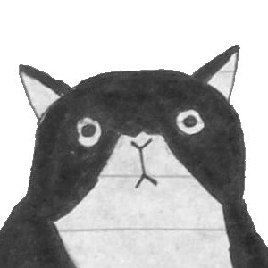
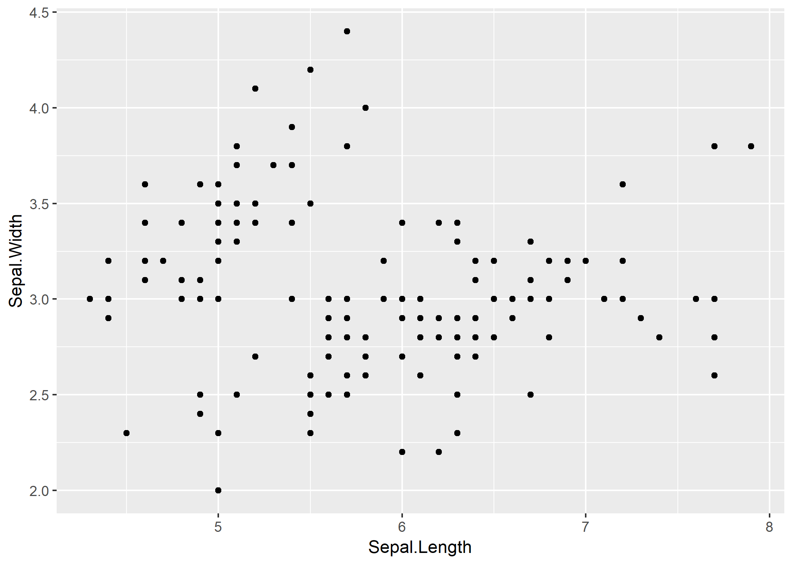

# narrater

Depending on where I get to before my talk, there will be either nothing or minimal scripts with my ideas and development for the narrater R package.


<!--html_preserve--><button onclick="playSound(&#39;narrations/narration1.wav&#39;)" title="I want to create this package for two reasons: one, my students get stressed out when they see lots of text on a page, including code, so I want a way to reduce the amount of text used but still be able to communicate or describe ideas. And two, I want to be able to model reading the code for students even if I am not able to do this in person beside them at their computer! Try clicking on some of the things below" class="narrate">Tell me more about the idea for this package!</button><!--/html_preserve-->


<!--html_preserve--><a onclick="playSound(&#39;narrations/narration2.wav&#39;)" title="You could attach narration to images, like my cute stats cat Elliot." class="narrate">

</a><!--/html_preserve-->

<!--html_preserve--><a onclick="playSound(&#39;narrations/narration3.wav&#39;)" title="And add narration to plots, like to say .. oh hey, iris data, aren&#39;t you suu-per interesting?" class="narrate">

</a><!--/html_preserve-->

::: {#code_demo}

```{.r .narrate}
library(readr)
read_csv('anna.csv')
```

<div data-pagedtable="false">
  <script data-pagedtable-source type="application/json">
{"columns":[{"label":["pet_type"],"name":[1],"type":["chr"],"align":["left"]},{"label":["pet_name"],"name":[2],"type":["chr"],"align":["left"]}],"data":[{"1":"cat","2":"Elliot"},{"1":"dog","2":"Snoopy"},{"1":"dog","2":"Bruno"},{"1":"cat","2":"Whiskas"},{"1":"cat","2":"Meba"},{"1":"cat","2":"Stanley"}],"options":{"columns":{"min":{},"max":[10]},"rows":{"min":[10],"max":[10]},"pages":{}}}
  </script>
</div>
:::


<script type="text/javascript">
$().ready(function(){

  //add a div with id "sounds"
  var elem = document.createElement('div');
  elem.id = "sounds";
  document.body.appendChild(elem);
  
  //change some of the css
  $("a.narrate").css({"pointer-events": "auto"});
  $("span.narrate").hover(function() {
    $(this).css("cursor","pointer");
    $(this).css("background-color","#c0c0c0");
  });
  $("a.narrate").hover(function() {
    $(this).css("cursor","pointer");
  });
  $("button.narrate").hover(function() {
    $(this).css("cursor","pointer");
  });
   $("pre.narrate").hover(function() {
    $(this).css("cursor","pointer");
  });
  
  //hardcoded
  $("#code_demo").attr('onClick','playSound("narrations/narration4.wav")');
})

function playSound(file_src) {
  document.getElementById("sounds").innerHTML = '<audio id="audio" src=' + file_src + ' autoplay="false" ></audio>';
  var sound = document.getElementById("audio");
  sound.play();
}
</script>
	

